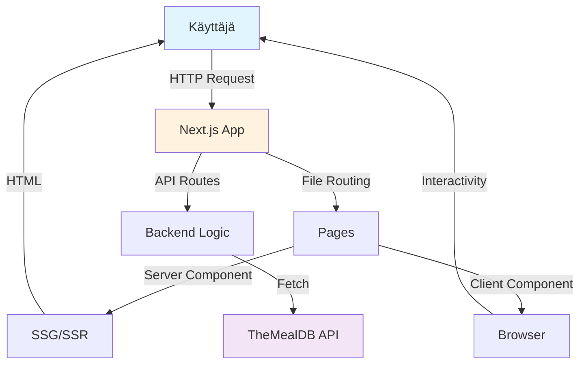
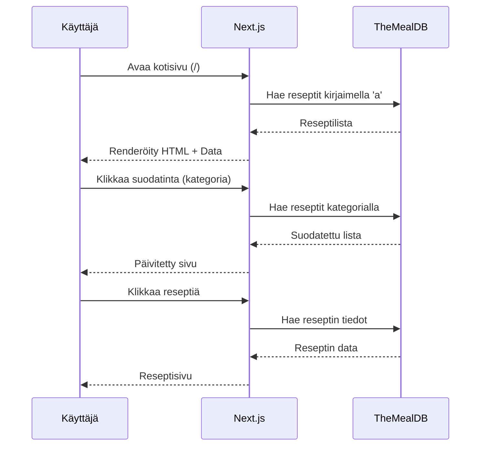

# Recipe Analyzer - Seminaarityöraportti

**Tekijä:** Musakhan Mamasaliev  
**Projekti:** Recipe Analyzer  
**GitHub:** https://github.com/MusaMamas/recipe-analyzer  
**Teknologiat:** Next.js 15, React, TypeScript, Tailwind CSS, TheMealDB API  
**Päivämäärä:** 20.11.2025

---

## 1. Johdanto

Tämä dokumentti esittelee Recipe Analyzer -nimisen web-sovelluksen suunnittelun, toteutuksen ja teknisen taustan. Sovellus on toteutettu modernilla Next.js 15 -sovelluskehyksellä ja hyödyntää ulkoista TheMealDB-rajapintaa reseptitietojen hakemiseen. Projektin tavoitteena oli perehtyä Next.js:n tarjoamiin full stack -ominaisuuksiin, kuten staattiseen sivugenerointiin (SSG), palvelin- ja asiakaskomponenttien yhteistoimintaan sekä sisäänrakennettuihin API-reitteihin.

## 2. Projektin tavoitteet ja lähtökohdat
Projektin keskeinen päämäärä oli kehittää sovellus, joka tarjoaa käyttäjälle yksinkertaisen ja tehokkaan tavan selata ja analysoida reseptejä. Tämän tavoitteen ohella työssä pyrittiin teknisesti ymmärtämään:
- miten Next.js:n App Router -arkkitehtuuri toimii,
- kuinka dataa voidaan hakea ja välimuistittaa palvelinympäristössä,
- milloin staattinen sivugenerointi on tarkoituksenmukaista,
- kuinka asiakaspuolen interaktiivisuus yhdistetään palvelinrenderöityihin näkymiin.

Nämä valinnat perustuvat Next.js-dokumentaatioon ja sen suosittelemiin suunnittelumalleihin.

## 3. Sovelluksen arkkitehtuuri

Next.js-sovelluksen rakenne noudattaa App Router -arkkitehtuuria:

```
recipe-analyzer/
├── app/
│   ├── api/
│   │   ├── analyze/
│   │   │   └── route.ts          # AI-analyysi API
│   │   └── search/
│   │       └── route.ts          # Reseptihaku API
│   ├── meals/
│   │   └── [id]/
│   │       └── page.tsx          # Staattinen reseptisivu
│   ├── about/
│   │   └── page.tsx              # Tietoja-sivu
│   ├── contact/
│   │   └── page.tsx              # Yhteystiedot-sivu
│   ├── layout.tsx                # Pääasettelu
│   ├── page.tsx                  # Kotisivu
│   └── globals.css               # Globaalit tyylit
├── components/
│   ├── AnalyzePanel.tsx          # Analyysi-komponentti
│   ├── MealCard.tsx              # Reseptikortti
│   ├── MealList.tsx              # Reseptilista
│   └── SearchAndFilter.tsx       # Haku ja suodatus
├── lib/
│   └── meals.ts                  # Tietomalli ja API-kutsut
├── public/                       # Staattiset tiedostot
├── next.config.ts                # Next.js-konfiguraatio
├── tailwind.config.ts            # Tailwind-konfiguraatio
└── tsconfig.json                 # TypeScript-konfiguraatio
```
Projektin hakemistorakenne perustuu Next.js 15:n tiedostopohjaiseen reititykseen. Keskeiset sovellusosat sijaitsevat `app/`-hakemistossa, joka sisältää muun muassa sivut, maketin ja API-reitit. Dynaamiset reseptisivut toteutetaan reitillä `app/meals/[id]/`, jonka staattiset parametrit generoidaan build-vaiheessa. Komponentit on koottu `components/`-hakemistoon ja ulkoisia rajapintoja käsittelevät funktiot `lib/meals.ts` -moduuliin.

Tämä rakenne noudattaa Next.js:n App Router -dokumentaation suosituksia ja varmistaa, että tietojen haku ja sivujen generointi on jaettu selkeästi eri tasoille.

## 4. Datanhaku ja staattinen sivugenerointi
Staattinen sivugenerointi (SSG) mahdollistaa reseptisivujen ennakkoluonnin. Sovellus hyödyntää `generateStaticParams()`-funktiota kerätäkseen kaikki saatavilla olevat resepti-ID:t TheMealDB-rajapinnasta. Esimerkiksi kirjainten läpikäynti toimii näin:

```ts
export async function generateStaticParams() {
  const letters = 'abcdefghijklmnopqrstuvwxyz'.split('');
  const allMeals = await Promise.all(
    letters.map(letter => fetchMealsByFirstLetter(letter))
  );
  const meals = allMeals.flat();

  return meals.map(meal => ({ id: meal.idMeal }));
}

// Optional: control fallback behavior via dynamicParams = true/false
export const dynamicParams = false; // generate only the IDs listed above
```

Kun dynamicParams on asetettu arvoon false, Next.js generoi vain ne dynaamiset reitit, jotka on määritelty staattisesti etukäteen, eikä salli muiden parametrien fallback-renderöintiä. Tämä vastaa Next.js:n SSG-dokumentaation ohjeistusta, jossa kehotetaan määrittämään staattiset parametrit, kun halutaan tuottaa rajattu joukko dynaamisia sivuja ilman fallbackia.

**Miksi SSG?**
1. **Nopeus**: Sivut renderöidään build-aikana, ei jokaisella pyynnöllä
2. **SEO**: Parempi hakukoneoptimointi staattisille sivuille
3. **Skaalautuvuus**: Ei palvelinkuormaa jokaista käyttäjää kohden
4. **Offline-tuki**: Sivut toimivat ilman palvelinta

## 5. API-reitit ja backend-toiminnallisuus
Sovellus sisältää sisäisiä API-reittejä (API Routes), jotka vastaavat esimerkiksi hakupyynnöistä. Näitä käsitellään kuten perinteisiä backend-päätepisteitä, mutta ne sijaitsevat samassa projektissa:

```ts
export async function GET(request: NextRequest) {
  const query = request.nextUrl.searchParams.get('q');
  const res = await fetch(`${API_BASE}/search.php?s=${query}`);
  const data = await res.json();
  return NextResponse.json(data);
}
```

Tämä arkkitehtuuri on rakennettu Next.js:n API Routes -ohjeiden mukaisesti.

**API Routes vs. perinteinen backend:**
- Ei tarvita erillistä Express-palvelinta
- Automaattinen TypeScript-tuki
- Helppo deployment Verceliin
- Samassa projektissa kuin frontend

### 5.1 Tietojen jako SSG:n ja API Routesien välillä

```typescript
const API_BASE = 'https://www.themealdb.com/api/json/v1/1';

// Funktio reseptien hakemiseen kirjaimella
export async function fetchMealsByFirstLetter(letter: string): Promise<Meal[]> {
  const res = await fetch(`${API_BASE}/search.php?f=${letter}`, {
    next: { revalidate: 3600 } // Cache 1 tunti
  });
  if (!res.ok) {
    throw new Error('Failed to fetch meals');
  }

  const data: MealsResponse = await res.json();
  return data.meals ?? [];
}
```
Sovelluksessa kaikki ateriatietojen käsittely on keskitetty yhteen paikkaan, `lib/meals.ts` -moduuliin. Tämä tiedosto määrittelee Meal-tyypin sekä joukon funktioita, joilla reseptit ja kategoriat voidaan hakea ulkoisesta `TheMealDB`-rajapinnasta. Esimerkiksi reseptien noutamiseen käytetty funktio muodostaa API-kutsun annetun alkukirjaimen perusteella, jolloin fetch pyytää osoitteesta `search.php?f=a` tai vastaavaa. Funktio palauttaa JSON-muotoisen vastauksen, josta poimitaan vain reseptilista. Samalla tavoin kategorioiden hakua varten on oma funktionsa, joka käsittelee rajapinnan palauttaman `list.php?c=list` -datan ja muuntaa sen pelkäksi kategoriaketjujen listaksi.

Sama moduuli palvelee sovelluksen useita eri osia. Staattisessa sivugeneroinnissa (`generateStaticParams`) näitä samoja haku­funktioita käytetään luomaan parametreja, joiden perusteella Next.js rakentaa valmiita sivuja build-vaiheessa. Server Components -puolella esimerkiksi page.tsx voi kutsua samoja funktioita, jolloin komponentti saa käyttöönsä tuoreet tiedot aina kun sivu renderöidään palvelimella. API-reiteillä, kuten `/api/search`, voidaan myös hyödyntää täsmälleen samoja haku­funktioita sen sijaan, että reitti tekisi erillisiä suoria API-kutsuja. Näin kaikki logiikka pysyy yhdessä paikassa, mikä vähentää koodin toisteisuutta ja helpottaa ylläpitoa.

___

### 5.2 Käytännön esimerkki: Staattinen sivu + Live API

**Kotisivu (`app/page.tsx`)**: Renderöidään palvelimella

```typescript
export default async function HomePage({ searchParams }: HomePageProps) {
  const params = await searchParams;
  const { letter = 'a', category, area, search } = params;

  // Haetaan tiedot build-aikana tai request-aikana
  const [categories, areas] = await Promise.all([
    fetchCategories(),
    fetchAreas()
  ]);

  let meals: Meal[] = [];
  if (search) {
    meals = await searchMeals(search);
  } else if (category) {
    meals = await fetchMealsByCategory(category);
  } else {
    meals = await fetchMealsByFirstLetter(letter);
  }
}
```

**SearchAndFilter-komponentti**: Client Component

```typescript
'use client';

export default function SearchAndFilter({ categories, areas }) {
  const router = useRouter();
  const [searchQuery, setSearchQuery] = useState('');

  // Lomakkeen lähetys kutsuu API:a
  const handleSearch = (e: React.FormEvent) => {
    e.preventDefault();
    if (searchQuery.trim()) {
      // Päivitetään URL, mikä triggaa server-puolen uudelleenrenderöinnin
      router.push(`/?search=${encodeURIComponent(searchQuery.trim())}`);
    }
  };
```
Tässä esimerkissä kotisivu toimii palvelinpuolella renderöitynä sivuna. `app/page.tsx` hakee kaikki tarvittavat tiedot joko build-vaiheessa tai käyttäjän pyynnön yhteydessä. Sivun alussa luetaan URL:sta välitetyt hakuehdot, kuten valittu kirjain, kategoria, alue tai vapaa hakusana. Tämän jälkeen palvelin suorittaa rinnakkaisesti kategorioiden ja alueiden haun, ja valitun hakutavan mukaan noutaa myös oikean reseptilistan. Jos URL sisältää hakusanan, käytetään hakufunktiota; jos kategoria on valittu, reseptit haetaan kategorian perusteella; muussa tapauksessa ladataan ne reseptit, jotka alkavat tietyllä kirjaimella. Lopuksi palvelin palauttaa rakenteen, jossa server-renderöityyn näkymään sijoitetaan hakukomponentti sekä lista löytyneistä aterioista.

Hakukomponentti on puolestaan client-puolen komponentti, joka tarjoaa interaktiivisen käyttöliittymän. Se sisältää lomakkeen ja tekstikentän, ja kun käyttäjä lähettää lomakkeen, komponentti päivittää selaimen URL-osoitetta esimerkiksi muotoon `/?search=kanakeitto`. Tämä URL-muutos ei suorita erillistä HTTP-kutsua API:in, vaan hyödyntää Next.js:n sisäistä reititystä. Kun osoite vaihtuu, palvelin renderöi kotisivun uudelleen ja hakee uudet tiedot sen perusteella, mitä URL:ssa nyt on.

Kokonaisuutena esimerkki näyttää, miten staattinen ja dynaaminen renderöinti voivat toimia rinnakkain. Sivun varsinainen data ladataan palvelinpuolella, mutta käyttöliittymän interaktiiviset ominaisuudet ovat client-komponenteissa. Kun käyttäjä tekee muutoksia, ne välittyvät automaattisesti palvelimelle URL-parametrien avulla, jolloin erillisiä frontendin API-kutsuja ei tarvita.

---

## 6. Käytetyt teknologiat

### 6.1 Next.js 15

**Tarkoitus:** Full-stack React -framework\
**Syy valintaan:** Moderni App Router, Server Components, automaattiset
optimoinnit, TS-tuki.

**Projektissa:** - App Router + file-based routing\
- Server/Client Components\
- API Routes\
- Image-komponentti

``` ts
const nextConfig = {
  images: {
    remotePatterns: [
      { protocol: 'https', hostname: 'www.themealdb.com', pathname: '/images/**' }
    ],
  },
};
```

### 6.2 TypeScript

**Tarkoitus:** Tyyppiturvallinen ohjelmointi\
**Syy valintaan:** Vähemmän virheitä, parempi kehittäjäkokemus.

``` ts
export interface Meal {
  idMeal: string;
  strMeal: string;
  [key: string]: any;
}

async function fetchMealById(id: string): Promise<Meal | null> {
  /* ... */
}
```

### 6.3 Tailwind CSS

**Tarkoitus:** Utility-first CSS\
**Syy valintaan:** Nopea ja joustava tyylien rakentaminen.

``` jsx
<main className="max-w-6xl mx-auto p-4">
  <h1 className="text-3xl font-bold">Recipe Analyzer</h1>
  <div className="grid md:grid-cols-2 lg:grid-cols-3 gap-4">
    {meals.map(m => <MealCard key={m.idMeal} meal={m} />)}
  </div>
</main>
```

### 6.4 TheMealDB API

**Tarkoitus:** Reseptidatan lähde\
**Syy valintaan:** Ilmainen, dokumentoitu ja laaja.

**Tärkeimmät endpointit:** - /search.php?s={name} - /lookup.php?i={id} -
/filter.php?c={category} - /list.php?c=list

``` ts
export async function fetchMealById(id: string) {
  const res = await fetch(
    `https://www.themealdb.com/api/json/v1/1/lookup.php?i=${id}`,
    { next: { revalidate: 3600 } }
  );
  const data = await res.json();
  return data.meals?.[0] ?? null;
}
```

### 6.5 Lucide React

**Tarkoitus:** Modernit SVG-ikonit käyttöliittymään

``` tsx
import { Search } from 'lucide-react';

<Search className="absolute left-3 top-1/2 -translate-y-1/2 text-gray-400" />
---

## 7. Oppimiskokemukset

### 7.1 Uudet oppimiskohteet

#### Next.js App Router
- Server Components vs. Client Components jako
- File-based routing -konsepti
- `generateStaticParams()` staattiseen generointiin
- `params` on nyt `Promise` Next.js 15:ssä

#### API Routes
- Backend-logiikka ilman erillistä palvelinta
- `NextRequest` ja `NextResponse` käyttö
- Error handling API-reiteissä

#### TypeScript
- Interface-määrittelyt
- Generic-tyypit (`Promise<Meal[]>`)
- Async/await TypeScriptin kanssa

#### SSG-strategiat
- Milloin käyttää SSG vs. SSR vs. CSR
- Caching-strategiat (`revalidate`)
- Dynamic parameters

### 7.2 Kehitetyt taidot

1. **Full-stack kehitys**: Frontend ja backend samassa projektissa
2. **Moderne React**: Server Components, async components
3. **API-integraatio**: Ulkoisen API:n käyttö ja virheenkäsittely
4. **Responsiivinen suunnittelu**: Tailwindin grid- ja flex-systeemin hyödyntäminen
5. **Git-versiohallin**: GitHub-repositorion käyttö ja dokumentointi

### 5.3 Haasteet ja ratkaisut

#### Haaste 1: 404-virheet dynaamisilla sivuilla

**Ongelma:** 
```
GET /meals/52890 404 in 167ms
```

Sivut generoitiin vain kirjaimelle "a", mutta käyttäjät yrittivät avata reseptejä muillakin kirjaimilla.

**Ratkaisu:**
```typescript
// Ennen: vain 'a'
const meals = await fetchMealsByFirstLetter('a');

// Jälkeen: kaikki kirjaimet
const letters = 'abcdefghijklmnopqrstuvwxyz'.split('');
const allMeals = await Promise.all(
  letters.map(letter => fetchMealsByFirstLetter(letter))
);
const meals = allMeals.flat();
```

#### Haaste 2: Source map -virheet

**Ongelma:**
```
Invalid source map. Only conformant source maps can be used.
```

**Ratkaisu:**
```typescript
// next.config.ts
const nextConfig = {
  productionBrowserSourceMaps: false, // Poista production source maps
  images: {
    remotePatterns: [
      {
        protocol: 'https',
        hostname: 'www.themealdb.com',
        pathname: '/images/**',
      },
    ],
  },
};
```

#### Haaste 3: Params Promise Next.js 15:ssä

**Ongelma:** Params-tyypin muutos Next.js 15:ssä

**Ratkaisu:**
```typescript
// Vanha Next.js 14
interface MealPageProps {
  params: { id: string };
}
const meal = await fetchMealById(params.id);

// Uusi Next.js 15
interface MealPageProps {
  params: Promise<{ id: string }>;
}
const { id } = await params;
const meal = await fetchMealById(id);
```

---

## 6. Jatkokehitys
Sovellusta on mahdollista laajentaa lisäämällä käyttäjäkohtaisia ominaisuuksia (esimerkiksi suosikkireseptit), oman tietokannan käyttöä, reseptien analyysitoimintoja tai ladattavia ostoslistoja. Kaikki nämä perustuisivat nykyiseen arkkitehtuuriin, jota voidaan laajentaa ilman suuria rakenteellisia muutoksia.

## 7. Kaaviot ja kuvat

### 7.1 Sovelluksen arkkitehtuuri



### 7.2 Tiedonkulku



## 8. Lähteet

1. **App Router Routing Basics**  
   https://nextjs.org/docs/14/app/building-your-application/routing  
   *How the `app/` directory, pages, layouts, and nested routes work.*

2. **Dynamic Routes + Static Generation (`generateStaticParams`)**  
   - Dynamic Routes: https://nextjs.org/docs/app/api-reference/file-conventions/dynamic-routes  
   - `generateStaticParams`: https://nextjs.org/docs/app/api-reference/functions/generate-static-params  
   *Used for `app/meals/[id]/page.tsx` in your project.*

3. **Data Fetching, Caching & Revalidation**  
   https://nextjs.org/docs/app/building-your-application/data-fetching/fetching-caching-and-revalidating  
   *Matches your usage of `fetch(..., { next: { revalidate: 3600 } })`.*

4. **Server vs Client Components**  
   https://nextjs.org/docs/app/getting-started/server-and-client-components  
   *Explains your server-rendered pages vs client components like `SearchAndFilter`.*

5. **Route Handlers (`app/api/.../route.ts`)**  
   https://nextjs.org/docs/app/building-your-application/routing/route-handlers  
   *Documentation for your `/api/search` and `/api/analyze` endpoints.*

6. **Next.js 15 Release Overview**  
   https://nextjs.org/blog/next-15  
   *Covers new behaviors like `params` becoming a Promise.*
---

## Yhteenveto

Recipe Analyzer -projekti osoittaa Next.js 15:n tehokkuuden modernin web-sovelluksen kehityksessä. Projekti yhdistää staattisen sivuston generoinnin (SSG) ja dynaamiset API Routes -toiminnot, luoden nopean ja käyttäjäystävällisen reseptisovelluksen.

Keskeisiä oppimiskohtia olivat:
- Server ja Client Components -jako
- File-based routing ja dynamic parameters
- API-integraatio ja virheenkäsittely
- TypeScriptin käyttö type-safety varmistamiseen
- Tailwind CSS:n hyödyntäminen nopeaan kehitykseen

Projekti tarjoaa hyvän pohjan jatkokehitykselle, ja tulevaisuudessa voidaan lisätä käyttäjätilejä, tietokantaa ja lisää interaktiivisia ominaisuuksia.

---

**Tekijä:** Musakhan Mamasaliev
**Päivämäärä:** 20.11.2025  
**Repositorio:** https://github.com/MusaMamas/recipe-analyzer  
**Lisenss:** MIT
