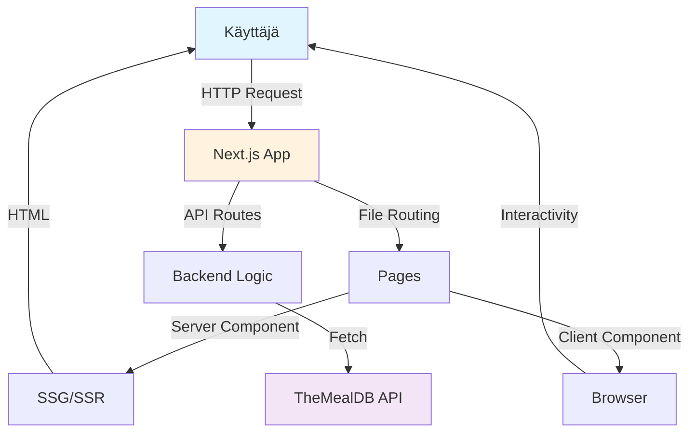
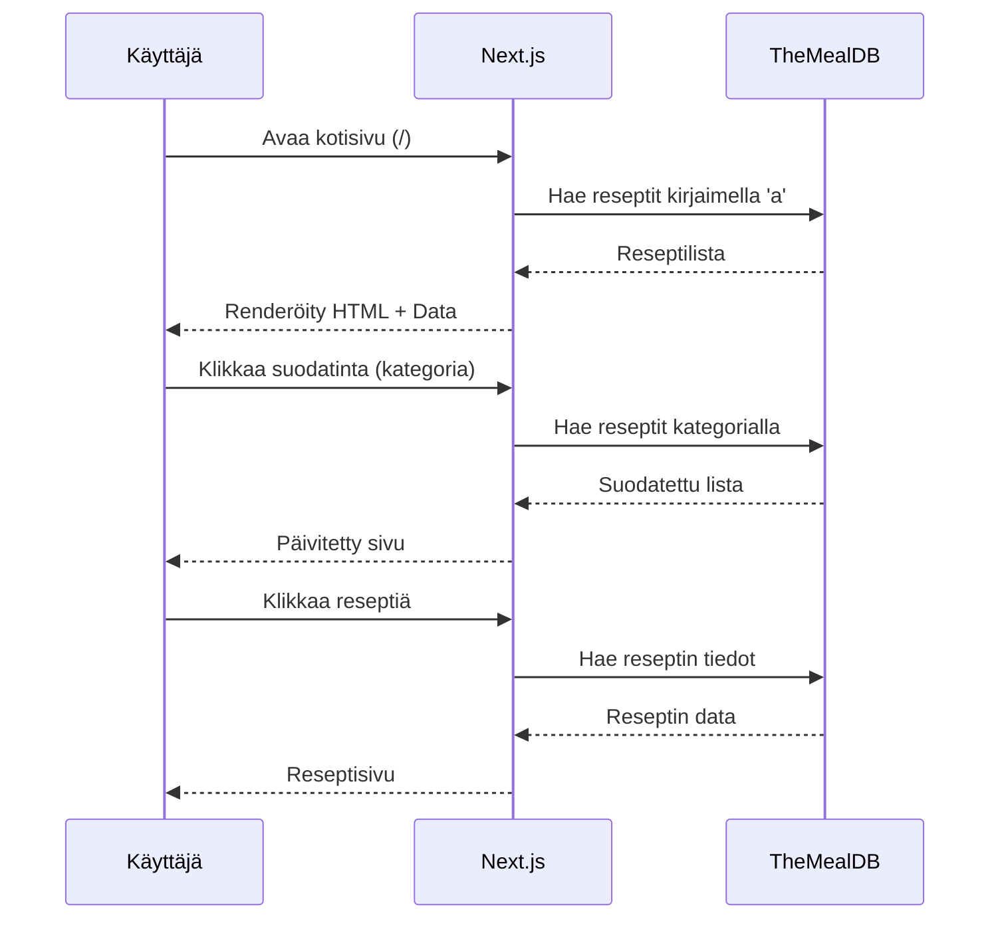
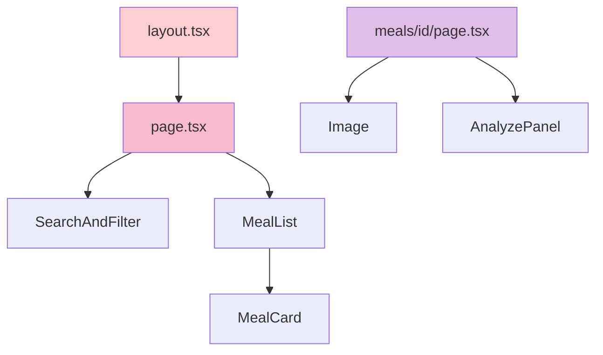
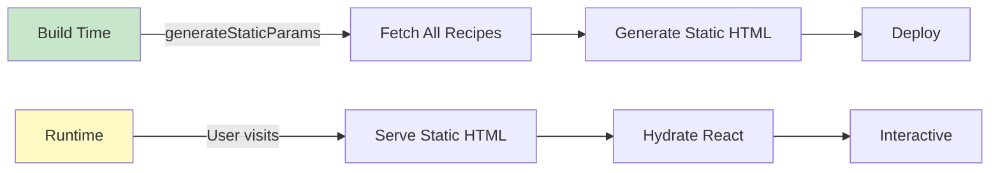

# Recipe Analyzer - Seminaarityöraportti

**Tekijä:** Musa Mamas  
**Projekti:** Recipe Analyzer  
**GitHub:** https://github.com/MusaMamas/recipe-analyzer  
**Teknologiat:** Next.js 15, React, TypeScript, Tailwind CSS, TheMealDB API  
**Päivämäärä:** Marraskuu 2025

---

## 1. Johdanto

Tämä seminaarityö käsittelee modernin web-sovelluksen kehittämistä Next.js-frameworkilla. Projekti on reseptien hakusovellus nimeltä **Recipe Analyzer**, joka hyödyntää TheMealDB:n ilmaista API:a reseptitietojen hakemiseen ja näyttämiseen.

### Työn tavoitteet

Projektin päätavoitteina on:
1. Oppia Next.js 15:n keskeiset konseptit, erityisesti Server-Side Generation (SSG) ja API Routes
2. Ymmärtää, miten Next.js eroaa perinteisestä React-sovelluksesta
3. Toteuttaa toimiva full-stack sovellus, joka hyödyntää ulkoista API:a
4. Soveltaa moderneja web-kehityksen parhaita käytäntöjä

### Valitut teknologiat

- **Next.js 15** - React-pohjainen framework SSG- ja SSR-tukella
- **TypeScript** - Tyypillinen JavaScript paremman kehittäjäkokemuksen saavuttamiseksi
- **Tailwind CSS** - Utility-first CSS-framework nopeaan tyylittelyyn
- **TheMealDB API** - Ilmainen resepti-API tietojen hakemiseen
- **Lucide React** - Modernit SVG-ikonit käyttöliittymään

---

## 2. Projektin tavoitteet

### Ratkaistava ongelma

Monet ihmiset etsivät jatkuvasti uusia resepti-ideoita, mutta reseptien etsiminen eri lähteistä voi olla työlästä. Recipe Analyzer tarjoaa helpon tavan:
- Etsiä reseptejä nimellä
- Selata reseptejä aakkosjärjestyksessä
- Suodattaa reseptejä kategorian mukaan (esim. Seafood, Dessert)
- Suodattaa reseptejä maan/keittiön mukaan (esim. Italian, Mexican)
- Nähdä yksityiskohtaiset ohjeet ja ainesosaluettelot

### Miksi nämä teknologiat valittiin?

#### Next.js 15
Next.js valittiin, koska:
- **SSG (Static Site Generation)**: Mahdollistaa nopean latausajan esirenderoinnin ansiosta
- **API Routes**: Mahdollistaa backend-toiminnallisuuden ilman erillistä palvelinta
- **File-based routing**: Yksinkertainen reittien hallinta tiedostojärjestelmän kautta
- **Image optimization**: Automaattinen kuvien optimointi
- **TypeScript-tuki**: Valmis tuki TypeScriptille

#### TypeScript
TypeScript parantaa koodin laatua:
- Tyyppien tarkistus kehitysaikana
- Parempi autocompletion
- Vähemmän runtime-virheitä
- Itsedokumentoiva koodi

#### Tailwind CSS
Tailwind valittiin nopeuttamaan kehitystä:
- Ei tarvitse kirjoittaa erillistä CSS:ää
- Konsistentti design-system
- Pieni bundle-koko (purge-toiminnon ansiosta)
- Responsiivinen design helposti

---

## 3. Toteutus

### 3.1 Projektin rakenne

Next.js-sovelluksen rakenne noudattaa App Router -arkkitehtuuria:

```
recipe-analyzer/
├── app/
│   ├── api/
│   │   ├── analyze/
│   │   │   └── route.ts          # AI-analyysi API
│   │   └── search/
│   │       └── route.ts          # Reseptihaku API
│   ├── meals/
│   │   └── [id]/
│   │       └── page.tsx          # Dynaaminen reseptisivu
│   ├── about/
│   │   └── page.tsx              # Tietoja-sivu
│   ├── contact/
│   │   └── page.tsx              # Yhteystiedot-sivu
│   ├── layout.tsx                # Pääasettelu
│   ├── page.tsx                  # Kotisivu
│   └── globals.css               # Globaalit tyylit
├── components/
│   ├── AnalyzePanel.tsx          # Analyysi-komponentti
│   ├── MealCard.tsx              # Reseptikortti
│   ├── MealList.tsx              # Reseptilista
│   └── SearchAndFilter.tsx       # Haku ja suodatus
├── lib/
│   └── meals.ts                  # Tietomalli ja API-kutsut
├── public/                       # Staattiset tiedostot
├── next.config.ts                # Next.js-konfiguraatio
├── tailwind.config.ts            # Tailwind-konfiguraatio
└── tsconfig.json                 # TypeScript-konfiguraatio
```

### 3.2 Sivut ja reitit

#### Pääreitit:
- `/` - Kotisivu reseptilistalla
- `/meals/[id]` - Yksittäisen reseptin sivu
- `/about` - Tietoja sovelluksesta
- `/contact` - Yhteystiedot

#### API-reitit:
- `/api/search` - Reseptien haku nimellä
- `/api/analyze` - AI-pohjainen reseptin analyysi

### 3.3 Static Site Generation (SSG)

SSG:tä hyödynnetään reseptisivuilla (`/meals/[id]/page.tsx`):

```typescript
// Generate static params (set of IDs) for SSG
export async function generateStaticParams() {
  // Generoidaan kaikille aakkosille
  const letters = 'abcdefghijklmnopqrstuvwxyz'.split('');
  
  const allMeals = await Promise.all(
    letters.map(letter => fetchMealsByFirstLetter(letter))
  );
  
  const meals = allMeals.flat();
  
  return meals.map((meal) => ({
    id: meal.idMeal,
  }));
}

// Salli dynaaminen generointi puuttuville ID:ille
export const dynamicParams = true;
```

**Miksi SSG?**
1. **Nopeus**: Sivut renderöidään build-aikana, ei jokaisella pyynnöllä
2. **SEO**: Parempi hakukoneoptimointi staattisille sivuille
3. **Skaalautuvuus**: Ei palvelinkuormaa jokaista käyttäjää kohden
4. **Offline-tuki**: Sivut toimivat ilman palvelinta

### 3.4 API Routes

API Routes mahdollistavat backend-logiikan Next.js-sovelluksessa:

#### Hakutoiminto (`/api/search/route.ts`):

```typescript
import { NextRequest, NextResponse } from 'next/server';

const API_BASE = 'https://www.themealdb.com/api/json/v1/1';

export async function GET(request: NextRequest) {
  const searchParams = request.nextUrl.searchParams;
  const query = searchParams.get('q');

  if (!query) {
    return NextResponse.json(
      { error: 'Search query is required' },
      { status: 400 }
    );
  }

  try {
    const res = await fetch(
      `${API_BASE}/search.php?s=${encodeURIComponent(query)}`
    );
    
    if (!res.ok) {
      throw new Error('Failed to fetch meals');
    }

    const data = await res.json();
    return NextResponse.json(data);
  } catch (error) {
    console.error('Search error:', error);
    return NextResponse.json(
      { error: 'Failed to search meals' },
      { status: 500 }
    );
  }
}
```

**API Routes vs. perinteinen backend:**
- Ei tarvita erillistä Express-palvelinta
- Automaattinen TypeScript-tuki
- Helppo deployment Verceliin
- Samassa projektissa kuin frontend

### 3.5 Ero tavalliseen React-sovellukseen

| Ominaisuus | Next.js | Perinteinen React |
|-----------|---------|-------------------|
| Renderöinti | Server & Client | Vain Client |
| Reititys | File-based | React Router |
| Backend | API Routes | Erillinen palvelin |
| SEO | Erinomainen | Heikko |
| Initial load | Nopea (SSG/SSR) | Hidas |
| Code splitting | Automaattinen | Manuaalinen |
| Image optimization | Sisäänrakennettu | Manuaalinen |

### 3.6 Tietojen jako SSG:n ja API Routesien välillä

Tiedot sijaitsevat keskitetysti `lib/meals.ts`-tiedostossa:

```typescript
// lib/meals.ts
export interface Meal {
  idMeal: string;
  strMeal: string;
  strCategory: string | null;
  strArea: string | null;
  strInstructions: string | null;
  strMealThumb: string | null;
  [key: string]: any;
}

const API_BASE = 'https://www.themealdb.com/api/json/v1/1';

// Funktio reseptien hakemiseen kirjaimella
export async function fetchMealsByFirstLetter(letter: string): Promise<Meal[]> {
  const res = await fetch(`${API_BASE}/search.php?f=${letter}`, {
    next: { revalidate: 3600 } // Cache 1 tunti
  });
  if (!res.ok) {
    throw new Error('Failed to fetch meals');
  }

  const data: MealsResponse = await res.json();
  return data.meals ?? [];
}

// Funktio kategorioiden hakemiseen
export async function fetchCategories(): Promise<string[]> {
  const res = await fetch(`${API_BASE}/list.php?c=list`, {
    next: { revalidate: 86400 } // Cache 24 tuntia
  });
  if (!res.ok) {
    throw new Error('Failed to fetch categories');
  }

  const data: { meals: { strCategory: string }[] | null } = await res.json();
  return data.meals ? data.meals.map(m => m.strCategory) : [];
}

// Muut funktiot...
```

**Sama moduuli käytetään:**
1. **SSG:ssä**: `generateStaticParams()` käyttää näitä funktioita
2. **Server Componentsissa**: `page.tsx` käyttää näitä funktioita
3. **API Routesissa**: `/api/search` voisi käyttää samoja funktioita (tällä hetkellä tekee suoran API-kutsun)

### 3.7 Käytännön esimerkki: Staattinen sivu + Live API

**Kotisivu (`app/page.tsx`)**: Renderöidään palvelimella

```typescript
export default async function HomePage({ searchParams }: HomePageProps) {
  const params = await searchParams;
  const { letter = 'a', category, area, search } = params;

  // Haetaan tiedot build-aikana tai request-aikana
  const [categories, areas] = await Promise.all([
    fetchCategories(),
    fetchAreas()
  ]);

  let meals: Meal[] = [];
  if (search) {
    meals = await searchMeals(search);
  } else if (category) {
    meals = await fetchMealsByCategory(category);
  } else {
    meals = await fetchMealsByFirstLetter(letter);
  }

  return (
    <main>
      {/* Server-renderöity sisältö */}
      <SearchAndFilter categories={categories} areas={areas} />
      <MealList meals={meals} title={title} />
    </main>
  );
}
```

**SearchAndFilter-komponentti**: Client Component

```typescript
'use client';

export default function SearchAndFilter({ categories, areas }) {
  const router = useRouter();
  const [searchQuery, setSearchQuery] = useState('');

  // Lomakkeen lähetys kutsuu API:a
  const handleSearch = (e: React.FormEvent) => {
    e.preventDefault();
    if (searchQuery.trim()) {
      // Päivitetään URL, mikä triggaa server-puolen uudelleenrenderöinnin
      router.push(`/?search=${encodeURIComponent(searchQuery.trim())}`);
    }
  };

  return (
    <form onSubmit={handleSearch}>
      <input
        type="text"
        value={searchQuery}
        onChange={(e) => setSearchQuery(e.target.value)}
        placeholder="Search recipes..."
      />
      <button type="submit">Search</button>
    </form>
  );
}
```

**Tämä osoittaa:**
1. Sivut generoidaan staattisesti tai server-puolella
2. Client-komponentit voivat olla interaktiivisia
3. URL-muutokset triggaavat server-puolen päivityksiä
4. Ei tarvita erillisiä API-kutsuja frontendistä (käytetään Next.js-reititystä)

---

## 4. Käytetyt teknologiat

### 4.1 Next.js 15

**Mitä varten:** Full-stack React framework  
**Miksi valittiin:** 
- App Router moderne arkkitehtuuri
- Server Components oletuksena
- Automaattinen optimointi
- Zero-config TypeScript-tuki

**Toteutus projektissa:**
- File-based routing App Routerilla
- Server Components päänäkymiin
- Client Components interaktiivisiin osiin
- API Routes backend-logiikkaan
- Image-komponentti optimoituihin kuviin

```typescript
// next.config.ts
const nextConfig: NextConfig = {
  images: {
    remotePatterns: [
      {
        protocol: 'https',
        hostname: 'www.themealdb.com',
        pathname: '/images/**',
      },
    ],
  },
  productionBrowserSourceMaps: false,
};
```

### 4.2 TypeScript

**Mitä varten:** Tyypillinen ohjelmointi  
**Miksi valittiin:** Parempi kehittäjäkokemus ja vähemmän virheitä

**Toteutus projektissa:**

```typescript
// Interfacet reseptitiedoille
export interface Meal {
  idMeal: string;
  strMeal: string;
  strCategory: string | null;
  strArea: string | null;
  strInstructions: string | null;
  strMealThumb: string | null;
  [key: string]: any;
}

// Props-tyypit komponenteille
interface MealPageProps {
  params: Promise<{ id: string }>;
}

// Async-funktioiden paluuarvot
async function fetchMealById(id: string): Promise<Meal | null> {
  // ...
}
```

### 4.3 Tailwind CSS

**Mitä varten:** Utility-first CSS-framework  
**Miksi valittiin:** Nopea kehitys ilman erillistä CSS:ää

**Toteutus projektissa:**

```jsx
// Responsiivinen layout Tailwindilla
<main className="max-w-6xl mx-auto py-8 px-4">
  <h1 className="text-3xl font-bold mb-4">Recipe Analyzer</h1>
  
  {/* Grid-layout resepteille */}
  <div className="grid grid-cols-1 md:grid-cols-2 lg:grid-cols-3 gap-4">
    {meals.map(meal => (
      <MealCard key={meal.idMeal} meal={meal} />
    ))}
  </div>
  
  {/* Suodatusvalikot */}
  <select className="w-full px-4 py-2 border border-gray-300 rounded-lg 
                     focus:outline-none focus:ring-2 focus:ring-blue-500">
    {/* ... */}
  </select>
</main>
```

### 4.4 TheMealDB API

**Mitä varten:** Reseptitietojen lähde  
**Miksi valittiin:** Ilmainen, dokumentoitu, laaja valikoima

**API-endpoint-esimerkit:**
```
GET /search.php?s={name}       # Haku nimellä
GET /search.php?f={letter}     # Haku kirjaimella
GET /lookup.php?i={id}         # Yksittäinen resepti
GET /filter.php?c={category}   # Suodata kategorialla
GET /filter.php?a={area}       # Suodata maalla
GET /list.php?c=list           # Kategoriat
GET /list.php?a=list           # Maat
```

**Toteutus projektissa:**

```typescript
// Caching Next.js:n avulla
export async function fetchMealById(id: string): Promise<Meal | null> {
  const res = await fetch(
    `https://www.themealdb.com/api/json/v1/1/lookup.php?i=${id}`,
    {
      next: { revalidate: 3600 } // Revalidoi tunnin välein
    }
  );
  
  if (!res.ok) {
    throw new Error('Failed to fetch meal');
  }

  const data = await res.json();
  return data.meals ? data.meals[0] : null;
}
```

### 4.5 Lucide React

**Mitä varten:** Ikonit käyttöliittymään  
**Miksi valittiin:** Modernit SVG-ikonit, hyvä React-tuki

**Toteutus projektissa:**

```typescript
import { Search } from 'lucide-react';

// Hakukentässä
<Search className="absolute left-3 top-1/2 -translate-y-1/2 
                   text-gray-400 w-5 h-5" />
```

---

## 5. Oppimiskokemukset

### 5.1 Uudet oppimiskohteet

#### Next.js App Router
- Server Components vs. Client Components jako
- File-based routing -konsepti
- `generateStaticParams()` staattiseen generointiin
- `params` on nyt `Promise` Next.js 15:ssä

#### API Routes
- Backend-logiikka ilman erillistä palvelinta
- `NextRequest` ja `NextResponse` käyttö
- Error handling API-reiteissä

#### TypeScript
- Interface-määrittelyt
- Generic-tyypit (`Promise<Meal[]>`)
- Async/await TypeScriptin kanssa

#### SSG-strategiat
- Milloin käyttää SSG vs. SSR vs. CSR
- Caching-strategiat (`revalidate`)
- Dynamic parameters

### 5.2 Kehitetyt taidot

1. **Full-stack kehitys**: Frontend ja backend samassa projektissa
2. **Moderne React**: Server Components, async components
3. **API-integraatio**: Ulkoisen API:n käyttö ja virheenkäsittely
4. **Responsiivinen suunnittelu**: Tailwindin grid- ja flex-systeemin hyödyntäminen
5. **Git-versiohallin**: GitHub-repositorion käyttö ja dokumentointi

### 5.3 Haasteet ja ratkaisut

#### Haaste 1: 404-virheet dynaamisilla sivuilla

**Ongelma:** 
```
GET /meals/52890 404 in 167ms
```

Sivut generoitiin vain kirjaimelle "a", mutta käyttäjät yrittivät avata reseptejä muillakin kirjaimilla.

**Ratkaisu:**
```typescript
// Ennen: vain 'a'
const meals = await fetchMealsByFirstLetter('a');

// Jälkeen: kaikki kirjaimet
const letters = 'abcdefghijklmnopqrstuvwxyz'.split('');
const allMeals = await Promise.all(
  letters.map(letter => fetchMealsByFirstLetter(letter))
);
const meals = allMeals.flat();

// Salli myös dynaamiset sivut
export const dynamicParams = true;
```

#### Haaste 2: Source map -virheet

**Ongelma:**
```
Invalid source map. Only conformant source maps can be used.
```

**Ratkaisu:**
```typescript
// next.config.ts
const nextConfig = {
  productionBrowserSourceMaps: false, // Poista production source maps
  images: {
    remotePatterns: [
      {
        protocol: 'https',
        hostname: 'www.themealdb.com',
        pathname: '/images/**',
      },
    ],
  },
};
```

#### Haaste 3: Params Promise Next.js 15:ssä

**Ongelma:** Params-tyypin muutos Next.js 15:ssä

**Ratkaisu:**
```typescript
// Vanha Next.js 14
interface MealPageProps {
  params: { id: string };
}
const meal = await fetchMealById(params.id);

// Uusi Next.js 15
interface MealPageProps {
  params: Promise<{ id: string }>;
}
const { id } = await params;
const meal = await fetchMealById(id);
```

---

## 6. Jatkokehitys

### 6.1 Suunnitellut parannukset

#### Käyttäjäominaisuudet
1. **Suosikkien tallennus**: LocalStorage tai tietokanta suosikeille
2. **Ostoslistan generointi**: Ainesosalista vietävissä PDF:ksi
3. **Reseptien arvostelu**: Käyttäjien arvostelut ja kommentit
4. **Käyttäjätilit**: Autentikointi ja henkilökohtaiset profiilit

#### Tekninen kehitys
1. **Tietokanta**: PostgreSQL tai MongoDB omille resepteille
2. **Kuvien lataus**: Mahdollisuus ladata omia kuvia
3. **PWA**: Progressive Web App offline-tukeen
4. **Testaus**: Jest ja React Testing Library testien kirjoittamiseen
5. **Analytics**: Käyttötilastojen seuranta

### 6.2 Uudet ominaisuudet

#### Ravintotieto-analyysi
- Kalorilaskuri
- Makroravinteiden jakauma
- Allergeenien tunnistus

#### Sosiaalinen ominaisuus
- Reseptien jakaminen
- Kommenttiosio
- Käyttäjien omat reseptit

#### Hakutoiminnon parantaminen
- Moninkertainen suodatus (kategoria + maa + ainesosa)
- Ainesosa-pohjainen haku ("Mitä voin tehdä näillä aineksilla?")
- Vaihtoehtoisten ainesosien ehdotukset

### 6.3 Teknologiavalinnat jatkossa

| Teknologia | Käyttötarkoitus | Miksi? |
|-----------|-----------------|--------|
| Prisma | ORM-työkalu | TypeScript-tuki, helppokäyttöinen |
| NextAuth.js | Autentikointi | Next.js-integraatio |
| React Query | State management | Palvelinpuolen tilan hallinta |
| Zod | Validointi | TypeScript-integraatio |
| Playwright | E2E-testaus | Luotettava testaustyökalu |
| Vercel | Hosting | Paras Next.js-tuki |

---

## 7. Kaaviot ja kuvat

### 7.1 Sovelluksen arkkitehtuuri



### 7.2 Tiedonkulku



### 7.3 Komponenttihierarkia



### 7.4 SSG vs CSR Flow



---

## 8. Lähteet

### Dokumentaatio ja oppaat

1. **Next.js Documentation**  
   URL: https://nextjs.org/docs  
   Käytetty: Next.js 15 App Router -dokumentaatio, API Routes, Image optimization

2. **React Documentation**  
   URL: https://react.dev  
   Käytetty: Server Components, Hooks, TypeScript-tuki

3. **TypeScript Handbook**  
   URL: https://www.typescriptlang.org/docs/  
   Käytetty: Interface-määrittelyt, Generic-tyypit

4. **Tailwind CSS Documentation**  
   URL: https://tailwindcss.com/docs  
   Käytetty: Utility classes, Responsive design, Configuration

5. **TheMealDB API Documentation**  
   URL: https://www.themealdb.com/api.php  
   Käytetty: API-endpointit, Query-parametrit

### Työkalut ja kirjastot

6. **Lucide React**  
   URL: https://lucide.dev/guide/packages/lucide-react  
   Käytetty: SVG-ikonit käyttöliittymään

7. **Vercel Platform**  
   URL: https://vercel.com/docs  
   Käytetty: Deployment-ohjeet, Environment variables

### Opetusmateriaalit

8. **Next.js Learn Course**  
   URL: https://nextjs.org/learn  
   Käytetty: App Router -konseptit, Data fetching -strategiat

9. **TypeScript Deep Dive**  
   URL: https://basarat.gitbook.io/typescript/  
   Käytetty: Advanced TypeScript patterns

### GitHub-repositoriot

10. **Recipe Analyzer Repository**  
    URL: https://github.com/MusaMamas/recipe-analyzer  
    Oma projekti: Lähdekoodi ja version history

11. **Next.js Examples**  
    URL: https://github.com/vercel/next.js/tree/canary/examples  
    Käytetty: Best practices, Code patterns

### Stack Overflow ja yhteisö

12. **Next.js GitHub Discussions**  
    URL: https://github.com/vercel/next.js/discussions  
    Käytetty: Ongelmanratkaisu, Params Promise -issue

13. **Stack Overflow - Next.js-tagit**  
    URL: https://stackoverflow.com/questions/tagged/next.js  
    Käytetty: 404-virhe ratkaisut, SSG-strategiat

### Videot ja tutoriaalit

14. **Next.js 15 Tutorial - Traversy Media**  
    YouTube: Traversy Media kanava  
    Käytetty: Käytännön esimerkkejä

15. **TypeScript Course for Beginners**  
    URL: https://www.youtube.com/typescript  
    Käytetty: TypeScript-perusteiden oppiminen

---

## Yhteenveto

Recipe Analyzer -projekti osoittaa Next.js 15:n tehokkuuden modernin web-sovelluksen kehityksessä. Projekti yhdistää staattisen sivuston generoinnin (SSG) ja dynaamiset API Routes -toiminnot, luoden nopean ja käyttäjäystävällisen reseptisovelluksen.

Keskeisiä oppimiskohtia olivat:
- Server ja Client Components -jako
- File-based routing ja dynamic parameters
- API-integraatio ja virheenkäsittely
- TypeScriptin käyttö type-safety varmistamiseen
- Tailwind CSS:n hyödyntäminen nopeaan kehitykseen

Projekti tarjoaa hyvän pohjan jatkokehitykselle, ja tulevaisuudessa voidaan lisätä käyttäjätilejä, tietokantaa ja lisää interaktiivisia ominaisuuksia.

---

**Tekijä:** Musa Mamas  
**Päivämäärä:** Marraskuu 2025  
**Repositorio:** https://github.com/MusaMamas/recipe-analyzer  
**Lisenss:** MIT
